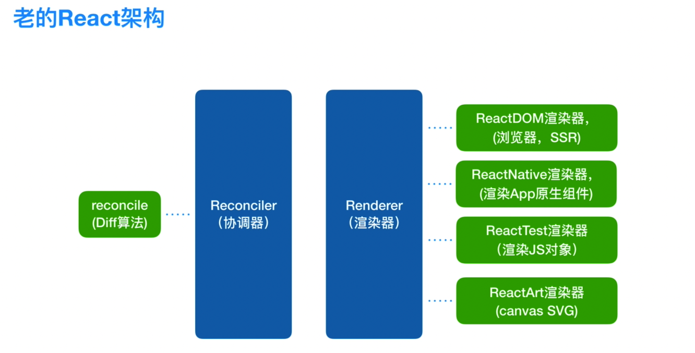
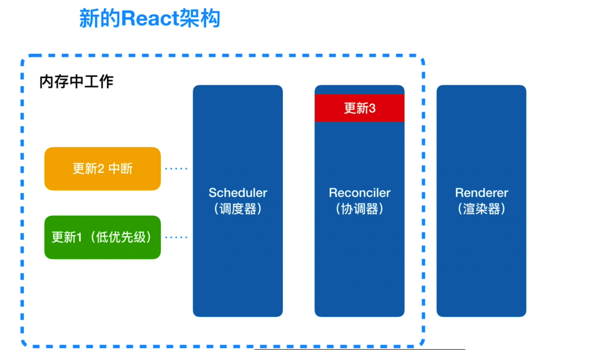
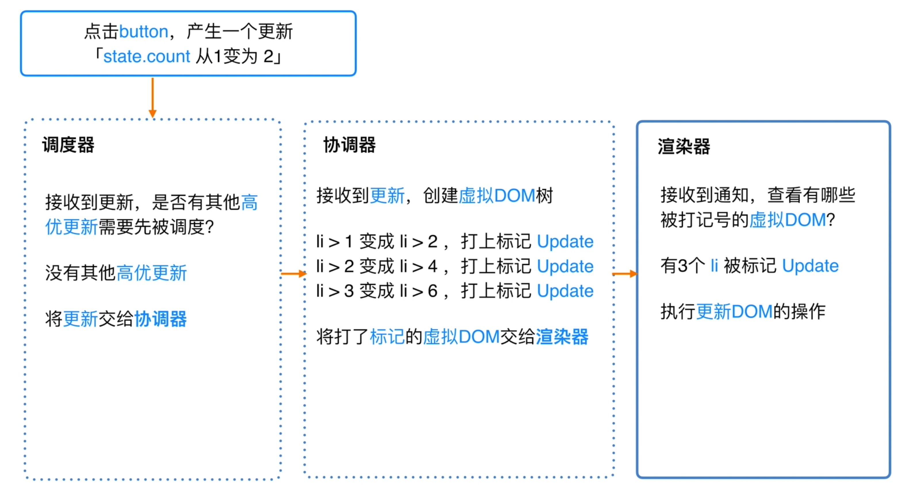

# React 技术揭秘笔记(总结版)

> 软件的设计是为了服务理念。只有懂了设计理念，才能明白为了实现这样的理念需要如何架构。所以，在我们深入源码架构之前，先来聊聊`React`理念。

[#](#react理念) React 理念
----------------------

我们可以从[官网 (opens new window)](https://zh-hans.reactjs.org/docs/thinking-in-react.html) 看到`React`的理念：

> 我们认为，React 是用 JavaScript 构建**快速响应**的大型 Web 应用程序的首选方式。它在 Facebook 和 Instagram 上表现优秀。

可见，关键是实现`快速响应`。那么制约`快速响应`的因素是什么呢？

我们日常使用 App，浏览网页时，有两类场景会制约`快速响应`：

* 当遇到大计算量的操作或者设备性能不足使页面掉帧，导致卡顿。

* 发送网络请求后，由于需要等待数据返回才能进一步操作导致不能快速响应。

这两类场景可以概括为：

* CPU 的瓶颈

* IO 的瓶颈

`React`为了践行 “构建**快速响应**的大型 Web 应用程序” 理念做出的努力。

其中的关键是解决 CPU 的瓶颈与 IO 的瓶颈。而落实到实现上，则需要将**同步的更新**变为**可中断的异步更新**。

---------------

## React架构

* 新架构DOM更新流程
  

## 异步可中断更新

* 代数效应
* Fiber（纤程）
* Fiber节点即虚拟DOM
